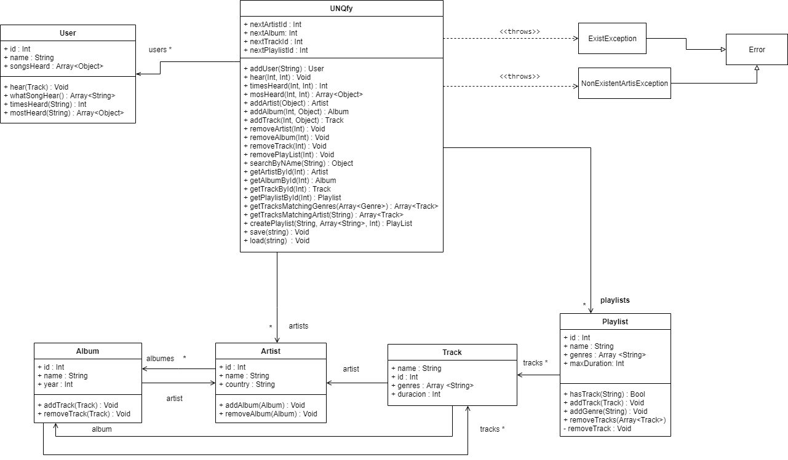

# WebServices

## Grupo 4
### Integrantes:

| Nombre y Apellido              |      Mail                      |     usuario Gitlab   |
| -----------------------------  | ------------------------------ | -------------------  |
| Gonzalo Verón                  | gonveron96@gmail.com           |  gonzaloVeron        |
| Ignacio Mendez                 |                                |  mendezigna          |

## Diagrama UML

## Uso de comandos

- addArtist [nombre del artista] [pais del artista]
- addAlbum [id del artista] [nombre del album] [año de creacion del album]
- addTrack [id del album] [nombre del track] [duracion del track] [generos del track]
- createPlaylist [nombre de playlist] [duracion maxima] [generos de la playlist]
- removeArtist [id del artista]
- removeAlbum [id del album]
- removeTrack [id del track]
- removePlayList [id de la playlist]
- searchByName [nombre a buscar]
- getTracksMatchingArtist [nombre del artista]
- getTracksMatchingGenres [generos del track]
- getArtistById [id del artista]
- getAlbumById [id del album]
- getTrackById [id del track]
- getPlaylistById [id del playlist]
- addUser [nombre del usuario]
- hear [id del usuario] [id del track]
- songsHeard [id del usuario]
- timesHeard [id del usuario] [id del track]
- mosHeard [id del usuario] [id del artista]